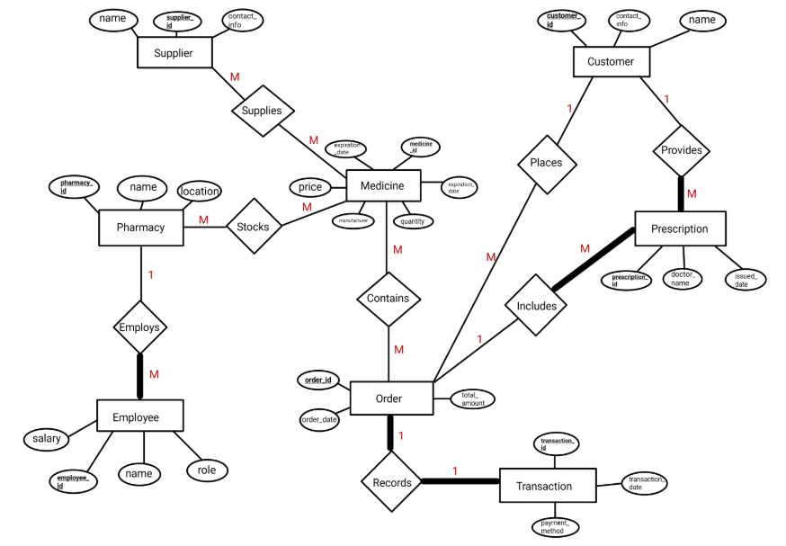

# 🏥 Pharmacy Inventory Management Database - Phase 1

## 📌 Project Overview
This project is a **relational database system** designed to manage pharmacy inventory, orders, prescriptions, employees, and transactions efficiently. The system enables tracking of **medicine stock**, **customer orders**, **prescriptions issued by doctors**, and **supplier deliveries**. 

This is **Phase 1**, focusing on **database design, ER modeling, table creation, and initial data insertion**.

---

## 🚀 Features Implemented in Phase 1
✅ **Entity-Relationship (ER) Model** with participation constraints  
✅ **Database Schema Design** with **Primary Keys (PK)** and **Foreign Keys (FK)**  
✅ **Table Creation** using `CREATE TABLE` statements  
✅ **Data Insertion** with `INSERT INTO` statements (10 rows per table)  
✅ **Relational Model Representation**  
✅ **Basic Queries for Data Retrieval**  

---

## 🗄️ Database Schema
The database consists of **11 tables**, structured with **Primary Keys (PK)** and **Foreign Keys (FK)** to ensure data integrity.

| Table Name        | Primary Key (PK)       | Foreign Keys (FK) & References |
|-------------------|-----------------------|--------------------------------|
| Pharmacy         | `pharmacy_id`         | N/A                            |
| Medicine         | `medicine_id`         | N/A                            |
| Supplier         | `supplier_id`         | N/A                            |
| Customer         | `customer_id`         | N/A                            |
| Orders          | `order_id`            | `customer_id` → Customer       |
| Prescription    | `prescription_id`      | `customer_id` → Customer, `order_id` → Orders |
| Employee        | `employee_id`          | `pharmacy_id` → Pharmacy      |
| TransactionTable| `transaction_id`       | `order_id` → Orders (1:1)     |
| Pharmacy_Medicine | (`pharmacy_id`, `medicine_id`) | `pharmacy_id` → Pharmacy, `medicine_id` → Medicine |
| Supplier_Medicine | (`supplier_id`, `medicine_id`) | `supplier_id` → Supplier, `medicine_id` → Medicine |
| Order_Medicine  | (`order_id`, `medicine_id`) | `order_id` → Orders, `medicine_id` → Medicine |

---

## 📊 Entity-Relationship (ER) Diagram
The ER diagram represents the entities and their relationships.


---

## 🔨 SQL Queries

### 1️⃣ **Table Creation**
The tables were created using **SQL `CREATE TABLE` statements**, with proper constraints.

```sql
CREATE TABLE Pharmacy (
    pharmacy_id INT AUTO_INCREMENT PRIMARY KEY,
    name VARCHAR(255) NOT NULL,
    location VARCHAR(255) NOT NULL
);
```

(View all table creation queries in [createtables.sql](createtables.sql])

---

### 2️⃣ **Data Insertion**
Each table contains **at least 10 rows**. Example:

```sql
INSERT INTO Pharmacy (name, location) VALUES
    ('Central Pharmacy', 'Downtown'),
    ('Green Health', 'Uptown'),
    ('CarePlus Pharmacy', 'Suburb A'),
    ('MediTrust', 'Suburb B'),
    ('HealthFirst', 'City Center');
```

## 🖥️ How to Set Up & Run the Project
Follow these steps to set up and use the database:
```
git clone https://github.com/basarzaim/Pharmacy-Inventory-Management-Database.git
cd Pharmacy-Inventory-Management-Database
```
##2️⃣ Import the SQL Files
1. Open MySQL Workbench or any MySQL client.
2. Execute create_tables.sql to create tables.
3. Execute insert.sql to populate tables.

##3️⃣ Verify Data
```
SELECT * FROM Pharmacy;
```

## 🔜 Future Work (Phase 2)
Implement advanced queries (e.g., JOINs, aggregations)
Develop a GUI interface
Add stored procedures and triggers
Optimize performance for large-scale data

## 📜 License
This project is open-source and available under the MIT License.


### **Instructions:**
1. **Copy-paste** this content directly **after** the `View all table creation queries in create_tables.sql)` line in your `README.md`.
2. **Ensure that `create_tables.sql` and `insert_data.sql` exist** in your repository.
3. **Commit and push** your changes using:
   ```bash
   git add README.md
   git commit -m "Updated README with setup, screenshots, and future work"
   git push origin main

